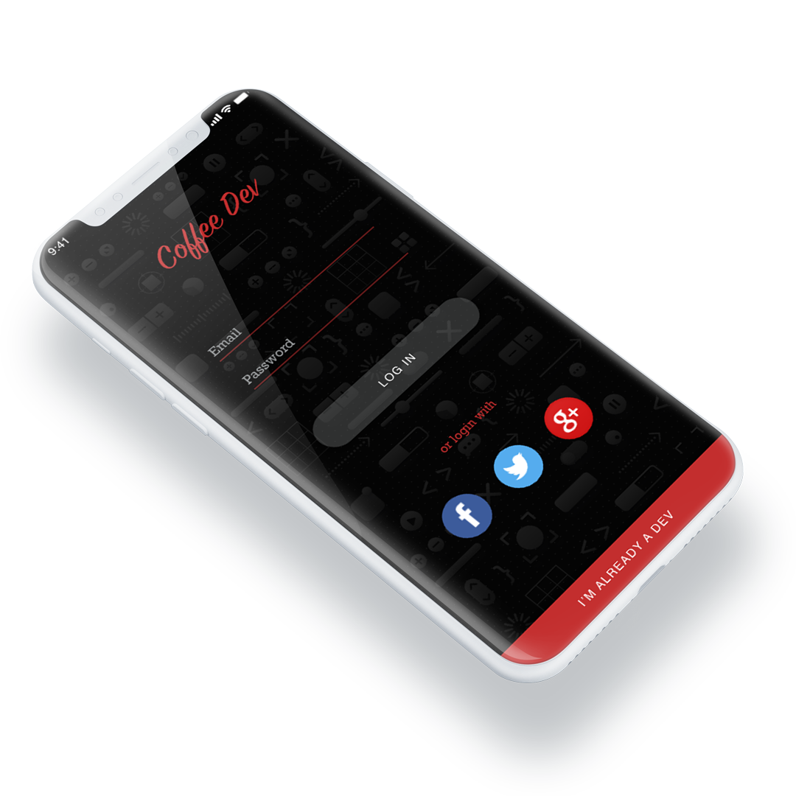
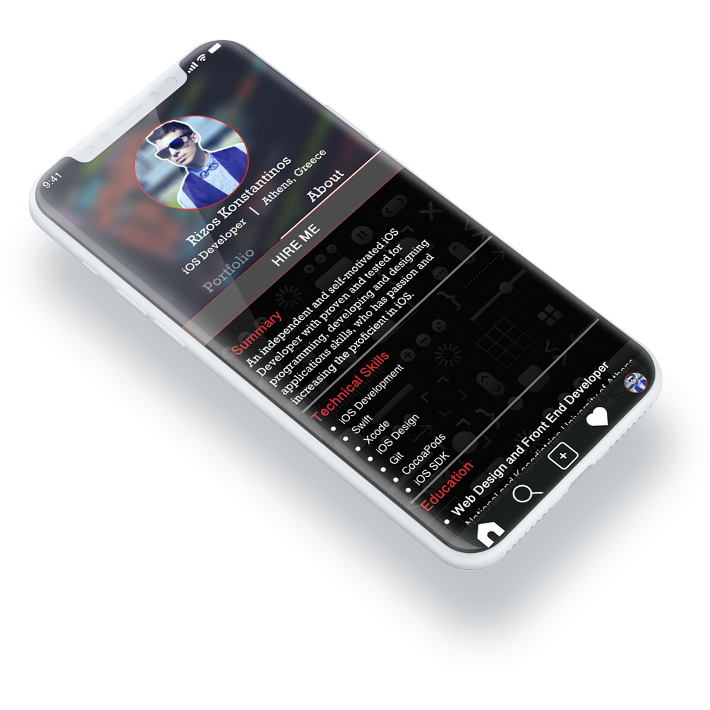
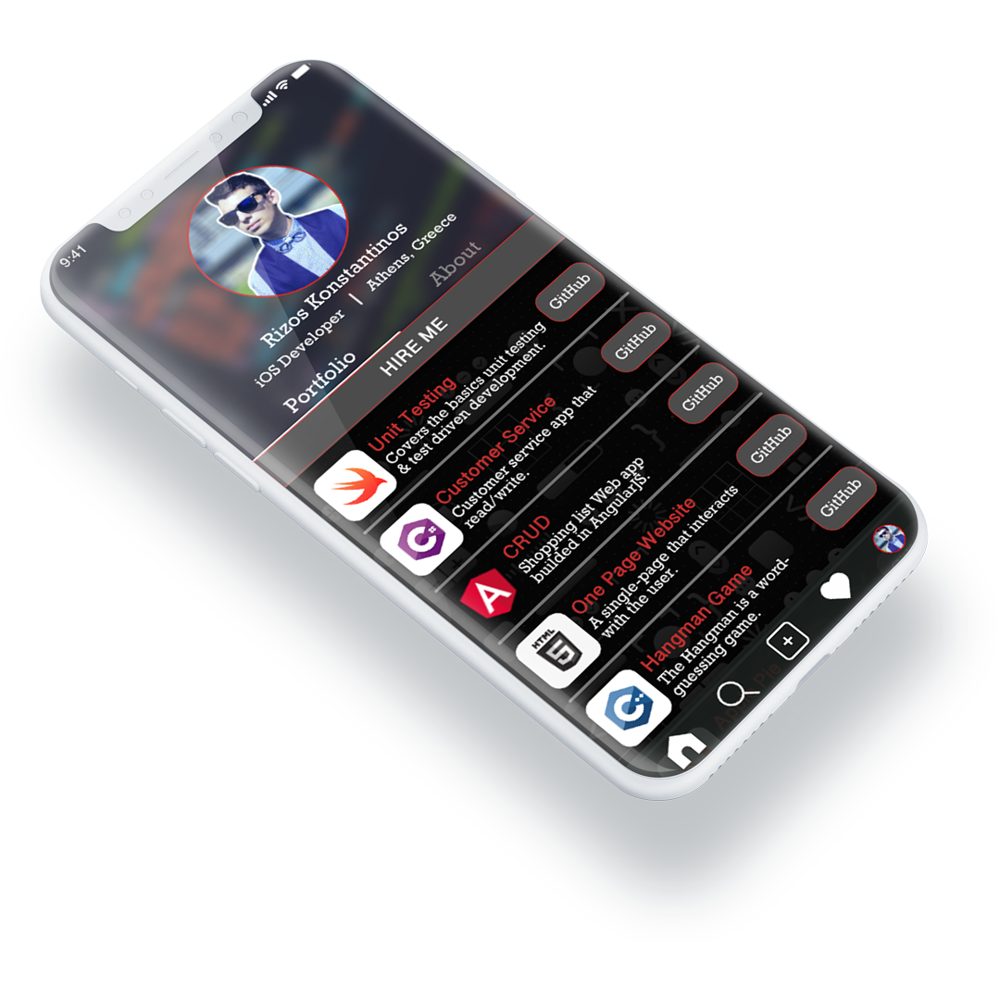
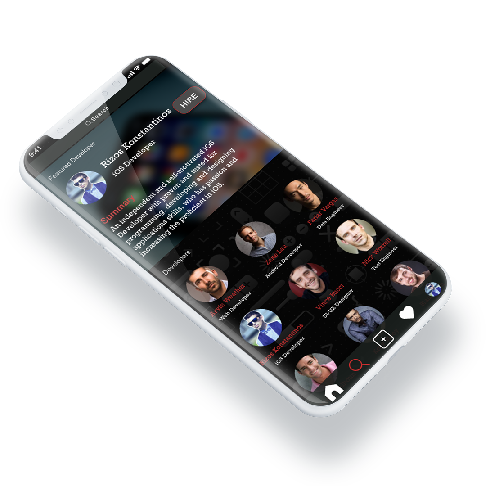

# DesignPrototypeMobileApp

### Design & Prototype a Mobile App

###### Part of the software development process is design.So i'm diving into Adobe Xd and learning as much as i can.

###### I make 4 screens:

+ `Log in` User is logging in to the app.

---
+ `About` User's about profile.

---
+ `Portfolio` User's portfolio profile.

---
+ `Search` User can search for other developers.

---

###### Below i have a sample of the app of how it looks like.

